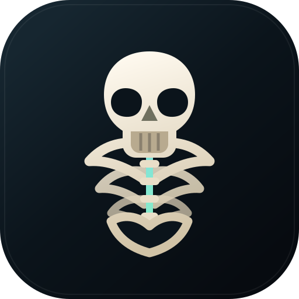

<div align="center">
  
  <h1>Pose Lab</h1>
  <p>Esqueleto humano anatômico em 3D com articulações interativas e limites aproximados de movimento.</p>
</div>

## Sobre

O Pose Lab é uma aplicação web para explorar e posar um esqueleto humano em
3D. O modelo anatômico é carregado localmente, separado em estruturas ósseas e
conectado a um rig criado em tempo de execução pelo Three.js.

A interface funciona em desktop e celular, pode ser instalada como PWA e
oferece controles para tronco, cabeça, braços, mãos, dedos, pernas e pés.

## Recursos

- Modelo anatômico humano com 278 estruturas identificadas.
- 61 controles de movimento organizados por região corporal.
- Movimentação individual dos cinco dedos de cada mão.
- Movimentação individual dos cinco dedos de cada pé.
- Acoplamento escapuloumeral durante a elevação dos braços.
- Inclinação pélvica em cadeia fechada, sem arrastar os fêmures.
- Flexão segmentada da coluna entre as regiões lombar e torácicas.
- Cotovelos e joelhos protegidos contra hiperextensão pelos controles.
- Acompanhamento aproximado da patela durante a flexão dos joelhos.
- Limites articulares aproximados para evitar poses extremas.
- Câmera orbital com rotação, zoom e centralização.
- Layout responsivo com painel inferior ou lateral no celular.
- Instalação como Progressive Web App (PWA).
- Modelo e decodificador Draco disponíveis localmente.

## Tecnologias

- HTML, CSS e JavaScript sem framework.
- Three.js r128.
- GLTFLoader e DRACOLoader.
- WebGL.
- Service Worker e Web App Manifest.

## Executando localmente

O projeto não precisa de instalação de dependências ou etapa de build. Use um
servidor HTTP, pois o modelo GLB e o service worker não funcionam corretamente
quando o `index.html` é aberto diretamente com `file://`.

### Requisitos

- Python 3 ou outro servidor HTTP local.
- Navegador moderno com WebGL habilitado.
- Internet no primeiro carregamento para baixar as bibliotecas Three.js das CDNs.

### Iniciar

Na raiz do projeto, execute:

```bash
python3 -m http.server 8080 --bind 127.0.0.1
```

Depois acesse:

```text
http://127.0.0.1:8080
```

Mantenha o terminal do servidor aberto enquanto estiver usando o aplicativo.

## Acessando pelo celular

### Com ngrok

Com o servidor local ativo na porta `8080`, abra outro terminal e execute:

```bash
ngrok http http://127.0.0.1:8080
```

Abra no celular o endereço `https://` exibido na linha `Forwarding`. Os dois
terminais, servidor e ngrok, precisam permanecer abertos.

Para utilizar um domínio ngrok já associado à sua conta:

```bash
ngrok http http://127.0.0.1:8080 --url=seu-dominio.ngrok-free.dev
```

Nunca publique ou compartilhe seu authtoken. Se ele for exposto, revogue a
credencial no painel do ngrok e gere uma nova.

### Pela rede local

Se o Mac e o celular estiverem na mesma rede Wi-Fi, também é possível iniciar o
servidor para a rede local:

```bash
python3 -m http.server 8080 --bind 0.0.0.0
```

Descubra o IP local do Mac e abra `http://IP-DO-MAC:8080` no celular. Esse modo
deixa o servidor acessível para outros dispositivos da mesma rede; encerre-o
com `Ctrl+C` quando terminar.

## Controles

- Arraste sobre a cena para girar a câmera.
- Use pinça no celular ou scroll no computador para controlar o zoom.
- Abra `Controles de movimento` para alterar a pose.
- Toque no nome de uma região corporal para expandir ou recolher seus controles.
- Use `Pose neutra` para zerar todos os movimentos.
- Use `Centralizar` para restaurar a câmera.
- Use `Tela cheia` para ampliar a área do aplicativo.

## Estrutura

| Caminho | Responsabilidade |
| --- | --- |
| `index.html` | Interface, estilos responsivos e carregamento das bibliotecas. |
| `app.js` | Cena 3D, rig anatômico, controles e regras de movimento. |
| `esqueleto-anatomico.glb` | Modelo anatômico carregado pela aplicação. |
| `draco/` | Decodificador Draco usado pelo GLTFLoader. |
| `icon.svg` | Marca, favicon e ícone da PWA. |
| `manifest.json` | Metadados de instalação da PWA. |
| `service-worker.js` | Cache local dos recursos principais. |
| `THIRD_PARTY_NOTICES.md` | Créditos e licença do modelo anatômico. |

## Como funciona

1. O `GLTFLoader` carrega o modelo comprimido com Draco.
2. A aplicação procura pontos anatômicos e calcula centros articulares.
3. As estruturas ósseas são agrupadas em pivôs para tronco e membros.
4. Cada slider aplica uma rotação limitada ao pivô correspondente.
5. Regras adicionais distribuem movimentos entre escápula e úmero, acompanham
   a patela e articulam as falanges dos dedos.

O modelo original não possui necessariamente um rig pronto para todos os
controles. A aplicação constrói essa articulação no navegador sem modificar o
arquivo GLB original.

## Solução de problemas

### `ERR_NGROK_8012`

O túnel está online, mas o servidor local não está respondendo. Inicie novamente:

```bash
python3 -m http.server 8080 --bind 127.0.0.1
```

Confirme no Mac que `http://127.0.0.1:8080` abre antes de testar o endereço do
ngrok.

### Endpoint ngrok offline

O processo do ngrok não está conectado. Execute novamente o comando do túnel e
mantenha seu terminal aberto.

### `ERR_NGROK_107`

O authtoken configurado é inválido ou foi revogado. Gere uma credencial nova no
painel do ngrok e configure-a localmente:

```bash
ngrok config add-authtoken SEU_NOVO_TOKEN
```

Não envie o token em mensagens, issues ou commits.

### Alterações antigas continuam aparecendo

O service worker pode estar usando uma versão anterior do cache. Recarregue a
página; se necessário, feche o app instalado e abra novamente. Em ferramentas
de desenvolvimento, também é possível limpar os dados do site.

### O modelo não carrega

- Confirme que `esqueleto-anatomico.glb` está na raiz.
- Confirme que os três arquivos necessários existem em `draco/`.
- Abra o console do navegador e procure erros de WebGL, GLTF ou rede.
- Verifique a conexão com a internet para carregar Three.js pelas CDNs.

## Créditos e licença do modelo

O arquivo `esqueleto-anatomico.glb` deriva do projeto
[Z-Anatomy / BodyParts3D](https://github.com/Z-Anatomy/Models-of-human-anatomy) e
é distribuído sob a licença
[Creative Commons Attribution-ShareAlike 4.0](https://creativecommons.org/licenses/by-sa/4.0/).

A conversão GLB usada como fonte está disponível em
[Liyucheng1997/242_lab-human-anatomy](https://github.com/Liyucheng1997/242_lab-human-anatomy).

Consulte [THIRD_PARTY_NOTICES.md](THIRD_PARTY_NOTICES.md) antes de redistribuir
o modelo ou uma adaptação.

## Aviso

Os movimentos, amplitudes e acoplamentos implementados são aproximações
biomecânicas para fins educacionais. O aplicativo não substitui material médico,
diagnóstico, avaliação clínica ou orientação profissional.
